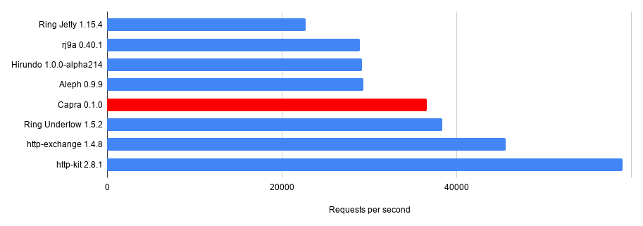
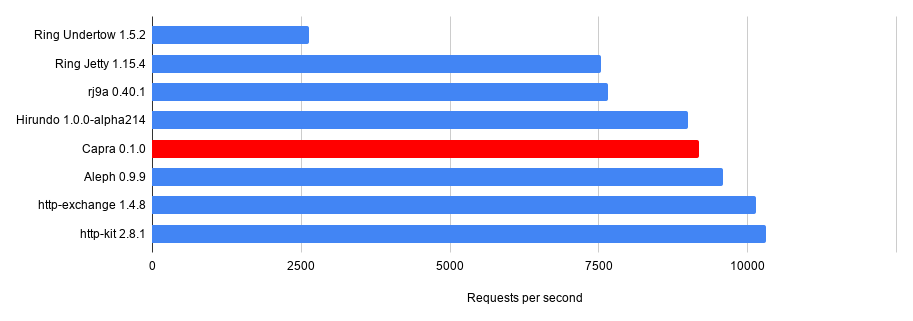

# Capra [](https://github.com/weavejester/capra/actions/workflows/test.yml)

Capra is a Correct[^1] and Adequantly Performant[^2] [Ring][] Adapter.

Capra supports HTTP/1.1 only and will not support older versions.
WebSocket support is planned in the near future. HTTP/2 support is
planned after that.

This adapter is currently **experimental** and not recommended for
production use.

[^1]: 'Correct' because Capra aims to be a well-behaved HTTP server and
a fully compliant Ring adapter.
[^2]: 'Adequately Performant' because Capra aims to be within a
reasonable margin of the fastest Ring adapters.

[ring]: https://github.com/ring-clojure/ring

## Installation

Add the following dependency to your deps.edn file:

    dev.weavejester/capra {:mvn/version "0.1.1"}

Or to your Leiningen project file:

    [dev.weavejester/capra "0.1.1"]

## Rationale

A number of web servers already exist for Clojure, but all of them are
predominantly written in Java; either because they are wrappers around
existing Java web servers, such as the [Ring Jetty Adapter][], or
because they are heavily optimized, such as [http-kit][].

Capra is written entirely in Clojure, and has only two dependencies:
Ring Core Protocols and [TeensyP][], which is also written entirely[^3]
in Clojure. This has several advantages:

1. The codebase is more concise, making it a flexible platform for
   trying out experimental Ring features.
2. It avoids the limitations and performance hit of wrapping an existing
   Java API, such as Jetty.
3. It can be more easily ported to Clojure-like environments that don't
   use the JVM.

[^3]: Excepting a couple of interfaces that are used to avoid using
`proxy` when creating custom `InputStream` and `OutputStream` classes.

[ring jetty adapter]: https://ring-clojure.github.io/ring/ring.adapter.jetty.html
[http-kit]: https://github.com/http-kit/http-kit
[teensyp]: https://github.com/weavejester/teensyp

## Usage

Given a Ring handler function:

```clojure
(defn handler [_request]
  {:status  200
   :headers {"Content-Type" "text/plain; charset=utf-8"}
   :body    "Hello World"})
```

We can start a web server using the `capra.server/run-server` function:

```clojure
(require '[capra.server :as capra])

(def server (capra/run-server handler :port 4000))
```

The options can be supplied as variadic arguments, or as a map.

The server will run in a separate thread until closed. The server
implements `java.io.Closeable`, so it can be closed via the `.close`
method.

```clojure
(.close server)
```

## Options

| Key                     | Description                                         | Default |
|-------------------------|-----------------------------------------------------|---------|
| `:async?`               | Whether to use 3-arity asynchronous Ring handlers   | false   |
| `:control-queue-size`   | The max number of queued control events             | 32      |
| `:direct-read-buffer?`  | Allocate a direct ByteBuffer for reads              | false   |
| `:error-handler`        | An async Ring handler called on uncaught exceptions |         |
| `:error-logger`         | A function that takes an exception and logs it      |         |
| `:executor`             | An `ExecutorService` to use for handler calls       |         |
| `:port`                 | The port number to listen on                        | 80      |
| `:read-buffer-size`     | The size in bytes of the channel read buffer        | 8K      |
| `:recv-buffer-size`     | The receive buffer size (i.e. the SO_RCVBUF option) |         |
| `:response-buffer-size` | The size of the buffer used for the response        | 32K     |
| `:reuse-address?`       | The SO_REUSEADDR socket option                      | false   |
| `:stream-buffer-size`   | The size of the request body InputStream buffer     | 8K      |
| `:write-buffer-size`    | The size in bytes of the channel write buffer       | 32K     |
| `:write-queue-size`     | The maximum number of writes that can be queued     | 64      |


## Performance

These benchmarks are carried out using the `wrk` HTTP benchmarking tool,
configured to use 2 threads and 128 simultaneous connections. The
machine used to benchmark is a CCX13 cloud server from [Hetzner][],
which has 2 cores. The default options for each adapter are used;
there's no additional tuning. The JVM used is OpenJDK 21.

### Minimal handler

The following benchmark tests different adapters running a Ring handler
that returns a minimal 'Hello World' response. 



This benchmark represents the best possible performance for each
adapter.

### 'Realistic' handler

The next benchmarks use a Ring handler that simulates a more realistic
load. The handler generates several thousand random numbers to simulate
work, and sleeps for several milliseconds to simulate waiting on
blocking I/O (such as from a database).



The results for this test are more tightly clustered, as the majority
of process time is now spent within the handler.

[Hetzner]: https://www.hetzner.com/

## License

Copyright © 2026 James Reeves

This program and the accompanying materials are made available under the
terms of the Eclipse Public License 2.0 which is available at
http://www.eclipse.org/legal/epl-2.0.

This Source Code may also be made available under the following Secondary
Licenses when the conditions for such availability set forth in the Eclipse
Public License, v. 2.0 are satisfied: GNU General Public License as published by
the Free Software Foundation, either version 2 of the License, or (at your
option) any later version, with the GNU Classpath Exception which is available
at https://www.gnu.org/software/classpath/license.html.
